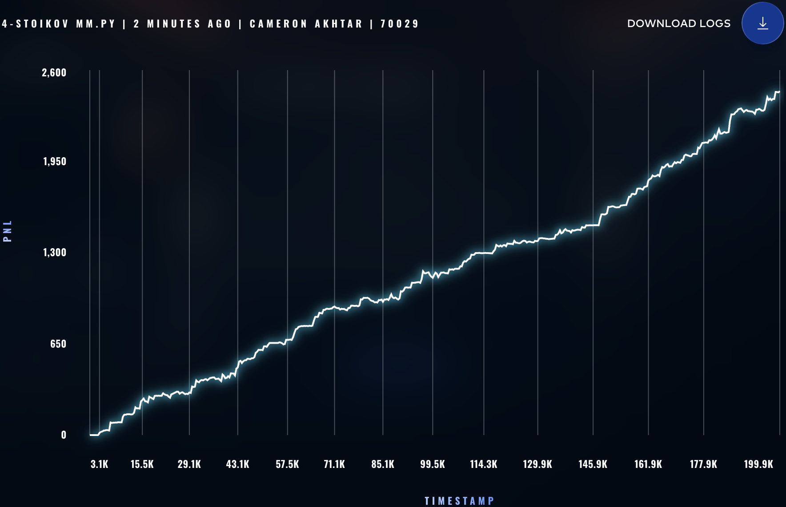
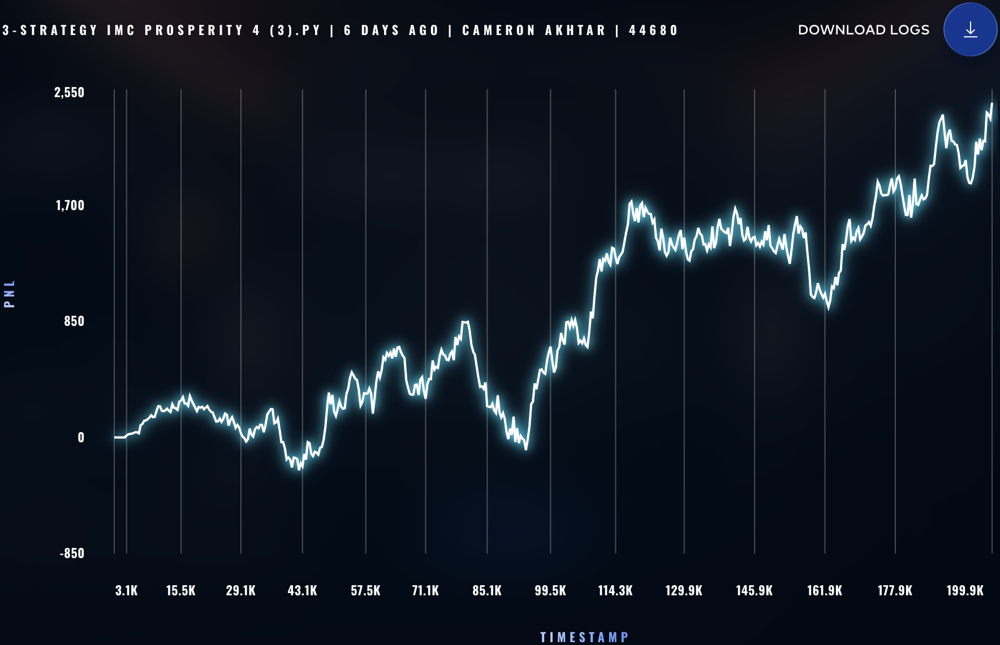

### ROUND 0 STRATS ###

# Stoikov Market-Making Strat

```python
class TomatoStrategy(MarketMakingStrategy):
    def get_true_value(self, state: TradingState) -> float:
        # 1. Get current mid-price and inventory
        mid_price = self.get_mid_price(state, self.symbol)
        inventory = state.position.get(self.symbol, 0)
        
        # 2. Avellaneda-Stoikov Parameters (Tune these in backtesting)
        gamma = 0.1  # Risk aversion parameter
        sigma = 2.0  # Volatility of Tomatoes
        
        # 3. Calculate Time Remaining Factor
        # Assuming a standard Prosperity round of 1,000,000 timestamps.
        # This creates a factor that goes from 1.0 (start) down to 0.0 (end).
        total_time = 1_000_000 
        time_left = max(0.0, (total_time - state.timestamp) / total_time)
        
        # 4. Calculate Reservation Price
        reservation_price = mid_price - (inventory * gamma * (sigma**2) * time_left)
        
        return reservation_price


class EmeraldStrategy(MarketMakingStrategy):
    def get_true_value(self, state: TradingState) -> float:
        # 1. Get current mid-price and inventory
        mid_price = self.get_mid_price(state, self.symbol)
        inventory = state.position.get(self.symbol, 0)
        
        # 2. Avellaneda-Stoikov Parameters (Tune these in backtesting)
        # Emeralds are traditionally very stable, so you might use a lower sigma
        # or a higher gamma if you want to strictly control inventory.
        gamma = 0.15 
        sigma = 1.0  
        
        # 3. Calculate Time Remaining Factor
        total_time = 1_000_000
        time_left = max(0.0, (total_time - state.timestamp) / total_time)
        
        # 4. Calculate Reservation Price
        reservation_price = mid_price - (inventory * gamma * (sigma**2) * time_left)
        
        return reservation_price
```

## Score: ~2,450




# Simple Market-Making Strat

```python
class TomatoStrategy(MarketMakingStrategy):
    def get_true_value(self, state: TradingState) -> float:
        return self.get_mid_price(state, self.symbol)

class EmeraldStrategy(MarketMakingStrategy):
    def get_true_value(self, state: TradingState) -> float:
        return self.get_mid_price(state, self.symbol)
```

## Score: ~2,451



