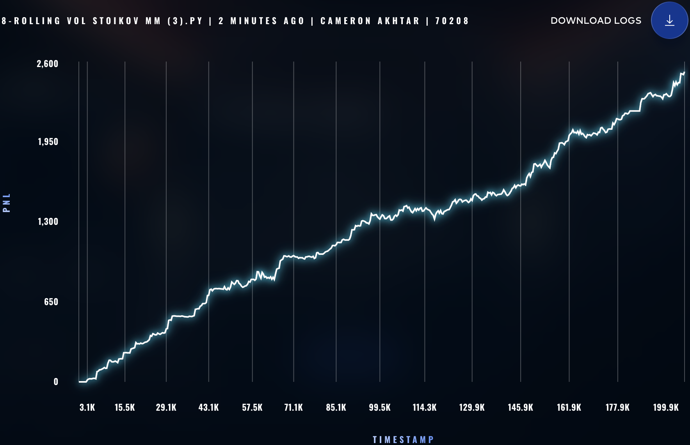

### ROUND 0 STRATS ###

# Rolling Vol Stoikov MM Strat

```python

class TomatoStrategy(MarketMakingStrategy, StatefulStrategy[dict[str, Any]]):
    def __init__(self, symbol: Symbol, limit: int) -> None:
        super().__init__(symbol, limit)
        self.history: list[float] = []
        self.window_size = 100

    def get_micro_price(self, state: TradingState) -> float:
        order_depth = state.order_depths[self.symbol]
        if not order_depth.buy_orders or not order_depth.sell_orders:
            return self.get_mid_price(state, self.symbol)
            
        best_bid, bid_vol = sorted(order_depth.buy_orders.items(), reverse=True)[0]
        best_ask, ask_vol = sorted(order_depth.sell_orders.items())[0]
        
        # In Prosperity, sell volumes are negative integers. We need absolute values.
        bid_vol = abs(bid_vol)
        ask_vol = abs(ask_vol)
        
        # Volume-weighted micro-price calculation
        return (best_bid * ask_vol + best_ask * bid_vol) / (bid_vol + ask_vol)

    def get_true_value(self, state: TradingState) -> float:
        # Use Micro-Price instead of Mid-Price
        micro_price = self.get_micro_price(state)
        inventory = state.position.get(self.symbol, 0)
        gamma = 0.005  
        
        self.history.append(micro_price)
        if len(self.history) > self.window_size:
            self.history.pop(0)

        if len(self.history) < 2:
            sigma = 2.0
        else:
            sigma = pd.Series(self.history).std()
            if pd.isna(sigma) or sigma < 1.0:
                sigma = 1.0 

        reservation_price = micro_price - (inventory * gamma * (sigma**2))
        
        # CRITICAL: Round to nearest integer to prevent the base Strategy's 
        # floor/ceil logic from aggressively tightening the spread.
        return round(reservation_price)

    def save(self) -> dict[str, Any]:
        return {"history": self.history}

    def load(self, data: dict[str, Any]) -> None:
        self.history = data["history"]


class EmeraldStrategy(MarketMakingStrategy, StatefulStrategy[dict[str, Any]]):
    def __init__(self, symbol: Symbol, limit: int) -> None:
        super().__init__(symbol, limit)
        self.history: list[float] = [] 

    def get_micro_price(self, state: TradingState) -> float:
        order_depth = state.order_depths[self.symbol]
        if not order_depth.buy_orders or not order_depth.sell_orders:
            return self.get_mid_price(state, self.symbol)
            
        best_bid, bid_vol = sorted(order_depth.buy_orders.items(), reverse=True)[0]
        best_ask, ask_vol = sorted(order_depth.sell_orders.items())[0]
        
        bid_vol = abs(bid_vol)
        ask_vol = abs(ask_vol)
        
        return (best_bid * ask_vol + best_ask * bid_vol) / (bid_vol + ask_vol)

    def get_true_value(self, state: TradingState) -> float:
        micro_price = self.get_micro_price(state)
        inventory = state.position.get(self.symbol, 0)
        gamma = 0.015  
        
        self.history.append(micro_price)
        if len(self.history) > 100:
            self.history.pop(0)

        reservation_price = micro_price - (inventory * gamma)
        
        # Round Emeralds as well to maintain their strict 2-tick spread
        return round(reservation_price)

    def save(self) -> dict[str, Any]:
        return {"history": self.history}

    def load(self, data: dict[str, Any]) -> None:
        self.history = data["history"]

```

## Score: ~2,518




# Stoikov Market-Making Strat

```python
class TomatoStrategy(MarketMakingStrategy):
    def get_true_value(self, state: TradingState) -> float:
        # 1. Get current mid-price and inventory
        mid_price = self.get_mid_price(state, self.symbol)
        inventory = state.position.get(self.symbol, 0)
        
        # 2. Avellaneda-Stoikov Parameters (Tune these in backtesting)
        gamma = 0.1  # Risk aversion parameter
        sigma = 2.0  # Volatility of Tomatoes
        
        # 3. Calculate Time Remaining Factor
        # Assuming a standard Prosperity round of 1,000,000 timestamps.
        # This creates a factor that goes from 1.0 (start) down to 0.0 (end).
        total_time = 1_000_000 
        time_left = max(0.0, (total_time - state.timestamp) / total_time)
        
        # 4. Calculate Reservation Price
        reservation_price = mid_price - (inventory * gamma * (sigma**2) * time_left)
        
        return reservation_price


class EmeraldStrategy(MarketMakingStrategy):
    def get_true_value(self, state: TradingState) -> float:
        # 1. Get current mid-price and inventory
        mid_price = self.get_mid_price(state, self.symbol)
        inventory = state.position.get(self.symbol, 0)
        
        # 2. Avellaneda-Stoikov Parameters (Tune these in backtesting)
        # Emeralds are traditionally very stable, so you might use a lower sigma
        # or a higher gamma if you want to strictly control inventory.
        gamma = 0.15 
        sigma = 1.0  
        
        # 3. Calculate Time Remaining Factor
        total_time = 1_000_000
        time_left = max(0.0, (total_time - state.timestamp) / total_time)
        
        # 4. Calculate Reservation Price
        reservation_price = mid_price - (inventory * gamma * (sigma**2) * time_left)
        
        return reservation_price
```

## Score: ~2,450


# Simple Market-Making Strat

```python
class TomatoStrategy(MarketMakingStrategy):
    def get_true_value(self, state: TradingState) -> float:
        return self.get_mid_price(state, self.symbol)

class EmeraldStrategy(MarketMakingStrategy):
    def get_true_value(self, state: TradingState) -> float:
        return self.get_mid_price(state, self.symbol)
```

## Score: ~2,451


