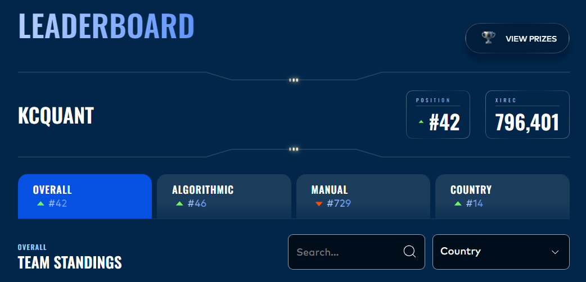
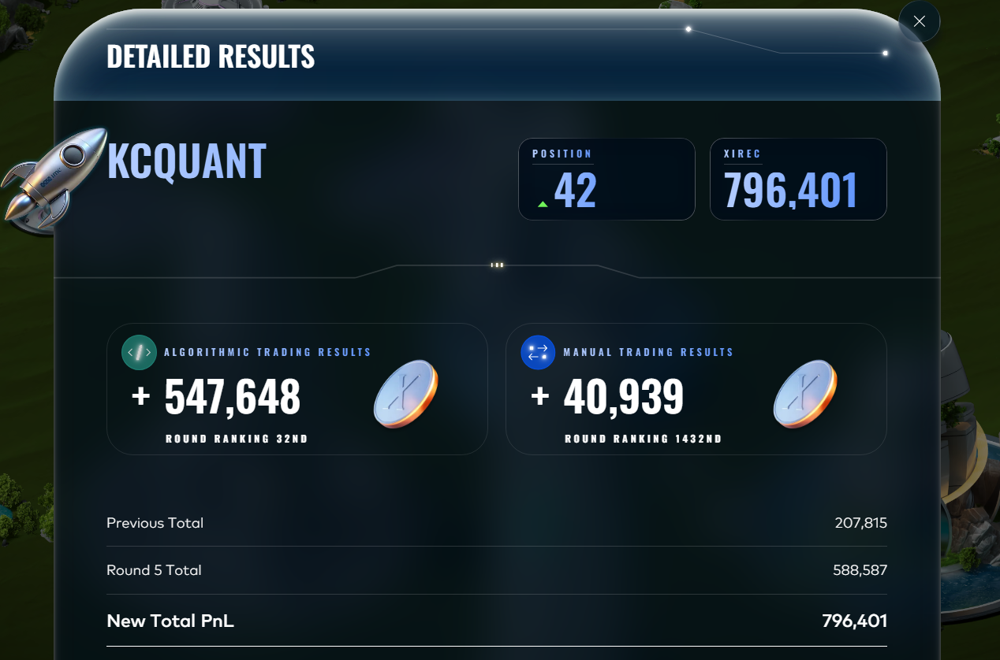

# IMC Prosperity 4

Algorithmic trading competition by [IMC](https://prosperity.imc.com/) — 5 rounds, ~18,000 teams globally. Each round adds new products; you implement a `Trader` class that the platform calls once per tick to return orders.

## 🏆 Final Results (April 2026)

* **Global Ranking:** #42 Overall
* **National Ranking (United States):** #14

### Leaderboard Snapshots



**Contributors:** [Cameron Akhtar](https://github.com/Ape108) · [Heagen Bell](https://github.com/heagenb03)

A round-by-round write-up series covering our decision process is in progress on Substack - ([Profile](https://substack.com/@heagenbell)). Currently [0 of 6 posts] drafted.

---

## 📁 Directory Structure

```text
├── datamodel.py          # Official IMC platform data model — do not modify
├── requirements.txt      # Python dependencies
├── datasets/             # prices_*.csv + trades_*.csv pairs for each round
│   ├── round_0/
│   ├── round1/           
│   ├── round2/
│   ├── round3/
│   ├── round4/
│   └── round5/
├── logs/                 # Backtest and submission logs/results
│   ├── r1/               
│   ├── r2/
│   ├── r3/
│   ├── r4/
│   └── r5/
├── manual/               # Manual trading analysis, Jupyter notebooks, and optimization scripts
│   ├── r2/               
│   ├── r3/
│   ├── r4/
│   └── r5/
├── reference/            # Backtester docs and external reference strategies (jmerle, timodiehm)
└── submissions/          # Shipped code, tests, and modularized logic
    ├── r1/
    ├── r2/
    ├── r3/
    ├── r4/
    │   ├── tests/        # EDA and imitation logic tests
    │   └── strategy.py
    ├── r5/
    │   ├── groups/       # Group-specific logic for the 50 R5 products
    │   ├── phase2/       # Phase 2 analysis, matrices, and regime classifications
    │   └── strategy.py   # Final R5 shipped submission
    └── tutorial/

```

---

## 🏗️ Architecture

### Credit

| Author | Resource | Role in this repo |
| --- | --- | --- |
| [jmerle](https://github.com/jmerle/imc-prosperity-3) | 25th place Prosp3 strategies | Class hierarchy (`Strategy`, `StatefulStrategy`, `MarketMakingStrategy`) & code reference |
| [timodiehm](https://github.com/TimoDiehm/imc-prosperity-3) | 2nd place Prosp3 strategies | Advanced theory/technique reference |
| [GeyzsoN](https://github.com/GeyzsoN/prosperity_rust_backtester) | Rust backtester | Faster & configurable tests mentioned below |
| [Equirag](https://prosperity.equirag.com/) | Online visualizer | Upload `submission.log` artifacts for order-level backtest/submission detail |

### Class Hierarchy

Base classes are copied (not imported) from `reference/jmerle_hybrid.py` into each submission.

```python
Strategy[T]                   # Base: symbol, limit, buy(), sell(), convert()
├── StatefulStrategy[T]       # Adds save()/load() for persisting state across ticks
│   └── SignalStrategy        # LONG/SHORT/NEUTRAL signal with position flattening
└── MarketMakingStrategy      # Quotes around a fair value; fills existing orders first

```

To add a strategy: subclass `MarketMakingStrategy` and implement `get_true_value()`, or subclass `SignalStrategy` and implement `get_signal()`.

---

## ⚙️ Workflow

### Windows Setup

```bash
.venv/Scripts/activate
pip install -r requirements.txt

```

### Backtesting

The backtester runs in WSL2. `$PROSP4` in the WSL2 `~/.bashrc` points to this directory.

```bash
cd ~/prosperity_rust_backtester

# 1. Quick default run
rust_backtester --trader "$PROSP4/submissions/rN/strategy.py" --dataset roundN

# 2. Conservative PnL check
rust_backtester --trader "$PROSP4/submissions/rN/strategy.py" --dataset roundN \
  --queue-penetration 0 --price-slippage-bps 5

```

**Decision rule:** consistency across all days > conservative PnL > default PnL.

Upload `runs/<backtest-id>/submission.log` to [prosperity.equirag.com](https://prosperity.equirag.com/) for order-level detail.

> *Note: Day numbering varies by round: R0/R1 use `-2,-1,0`; R3 uses `0,1,2`; R4 uses `1,2,3`; R5 uses `2,3,4`.*

